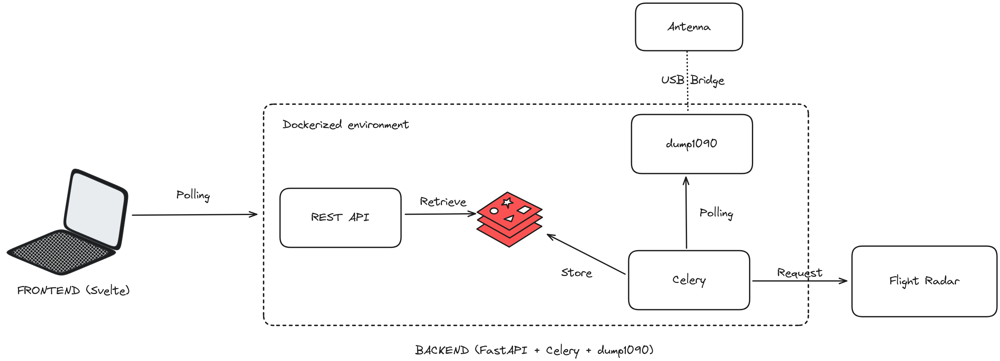

# WNS Project - Plane tracker

# Summary

The main idea of the project is to replicate plane tracker functionality in a local area using a RTL-SDR antenna.

The `dump1090` does provide some web interface similar to a plane tracker out of the box. But the data transmitted by `dump1090` is not complete flight data. The idea is to use the data we get from `dump1090` as base data for local flights, which we will then update by using flight radar data. In addition to that we will provide a basic interface to interact with this data.

# Services Overview



Multiple services work together to bring this app together. The frontend consists of an interface to interact with the data. It fetches the data through an REST API. The API uses Redis Cache as the main source for the data. Data is stored in the cache through a celery worker. This worker executes a task every couple of seconds which fetches the data from a `dump1090` service and then enriches the data using by querying some flight radar data.

A disclaimer: Now, flight-radar, doesn’t really have an official public API, but their endpoints are open. We picked out which endpoints can be used for finding our flight data and implement calls towards them in our task. Probably not a good idea to abuse these endpoints but for a small project like this there shouldn’t be a problem (🤞).

# Frontend

For frontend you can use whatever you like but we created a Svelte.js app bundled by Vite. UI components are provided by SvelteUI. The map and its functionalities are provided by the Leaflet.js library which uses Open Map. 

App consists of 2 components, map and sidebar. Map component fetches data from the backend every 2 seconds and updates the map with new plane markers. On the map you can see the planes and their flight names, after clicking on the plane, the lines are drawn on the map which show the plane’s trail and in the sidebar you can see the plane’s image and basic information about that flight.

To run the project you first need to install all required node packages by running this command in the terminal:

```bash
npm install
```

After that to run the app simply run the next command:

```bash
npm run dev
```

And here you can see all the packages that we used for the frontend:

```json
"name": "frontend",
  "private": true,
  "version": "0.0.0",
  "type": "module",
  "scripts": {
    "dev": "vite",
    "build": "vite build",
    "preview": "vite preview"
  },
  "devDependencies": {
    "@sveltejs/vite-plugin-svelte": "^2.4.2",
    "svelte": "^4.0.5",
    "vite": "^4.4.5"
  },
  "dependencies": {
    "@svelteuidev/composables": "^0.15.3",
    "@svelteuidev/core": "^0.15.3",
    "leaflet": "^1.9.4"
  }
}
```

# Backend

## Configuration and usage

The complete backend is set up with docker containers. The complete configuration can be found inside the `server/docker-compose.yml` file along with the `Dockerfile` base image configuration.

In short there are four docker services:

- FastAPI service
- Celery service
- Redis service
- `dump1090` service

The `dump1090` service can be set up in many different ways, but we find that the easiest way to implement it in an app like this is to use it prepackaged in a docker image.

To build up all these services simply run:

```bash
 docker compose build
```

This may take a couple of minutes. When it is ready you can simply run:

```bash
docker compose up
```

And there you go the backend is set up and ready to go.

## Implementation logic

Most of the implementation logic of the backend is actually located in the celery task. The FastAPI service simply uses the data from redis that the task generates.

Code for the task in question:

```python
@celery.task(name="collect_data")
def collect_data():
    resp = requests.get("http://plane_scanner:8080/data/aircraft.json")
    try:
        resp.raise_for_status()
    except:
        print("nothing found")
    data = resp.json()
    aircrafts = []
    for aircraft in data.get("aircraft", []):
        if flight := aircraft.get("flight"):
            flight_data = get_flight_radar_data(flight.strip())
            aircrafts.append({**flight_data, "dump1090_data": data})
            if flight_data:
                flight_id = flight_data["identification"]["number"]["default"]
                cache.set(flight_id, flight_data)
                print(f"set flight with number{flight_id}")
    cache.set("all_flights", aircrafts)
```

The flow here is:

- Fetch the data from `dump1090`
    - `dump1090` has a small http server which we can query for the aircraft JSON data
- Go through the aircrafts in the response
- For each aircraft fetch data from flight radar and load it together with `dump1090` data
    - To see the exact implementation for the `get_flight_radar_data` check out the complete file in `server/tasks/app.py`
- Set the flight data in cache